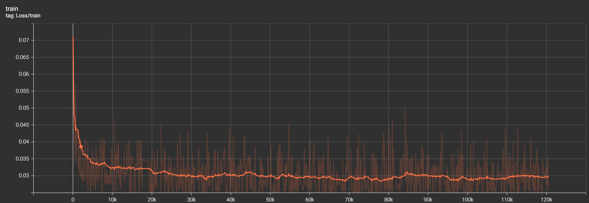
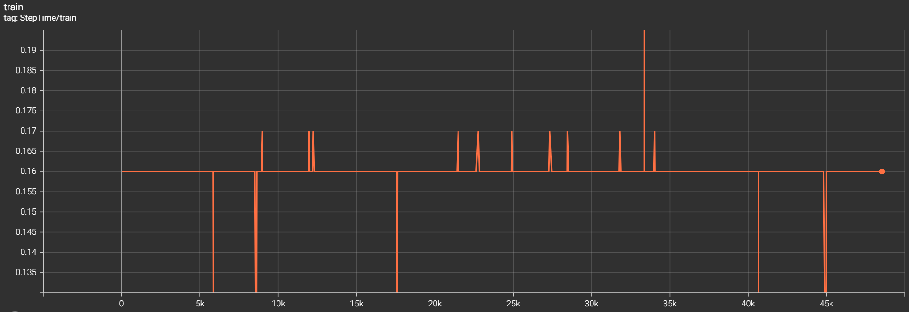
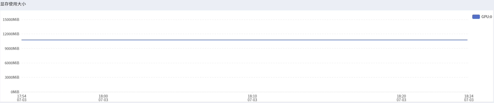
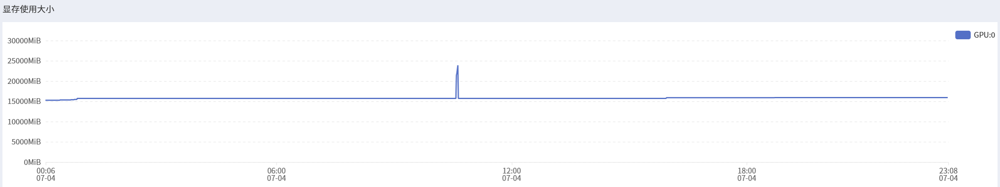
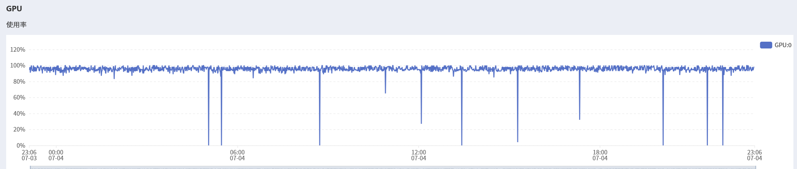
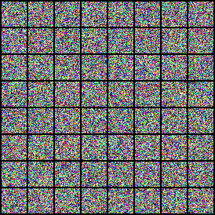

# Jittor-DDIM
**[English](./README_EN.md) | 简体中文**

   

##  项目简介

本项目基于 [Denoising Diffusion Implicit Models (DDIM)](https://arxiv.org/abs/2010.02502) 论文和[原 pytorch 项目](https://github.com/ermongroup/ddim/tree/main)，使用 Jittor 框架复现了 DDIM 模型的完整训练与采样流程。该项目旨在实现以下目标：

-  **使用 Jittor 框架从零构建 DDIM 模型结构**，包括 UNet、ResNetBlock、Self-Attention、Timestep Embedding 等关键模块；
-  **与 PyTorch 官方实现进行训练与采样对齐测试**，验证模型一致性；
-  **记录与可视化两个框架的 loss 曲线、训练性能指标（如 GPU 利用率、显存占用、每步时间等）**；
-  **展示两个框架采样过程动画（8x8 格式 GIF），评估生成质量对齐情况**；
-  **开源代码、数据准备脚本与运行日志**，并通过 README 汇总所有复现过程与结果。

本项目尤其适合想要深入理解 DDIM 原理，并探索 Jittor 在图像生成任务中性能的研究者与开发者。
## 项目结构与对齐说明（PyTorch vs Jittor）

本项目严格对齐了原始 PyTorch 实现的目录结构与模块划分，确保一一对应、方便核对与迁移。下表展示了两个版本的主目录结构对比，并附带每个文件/模块的简要说明：

| PyTorch 版本（`DDIM-Pytorch/`）      | Jittor 版本（`DDIM-jittor/`）         | 说明 |
|------------------------------------|--------------------------------------|------|
| `main.py`                          | `main.py`                            | 训练与采样主程序入口 |
| `requirements.txt`                | `requirements.txt`                  | Python 依赖库列表 |
| `stdout.txt`                      | `stdout.txt`                        | 控制台输出重定向日志 |
| `configs/`                        | `configs/`                          | 各数据集的超参数配置 |
| `configs/cifar10.yml`            | `configs/cifar10.yml`              | CIFAR10 训练配置 |
| `datasets/`                       | `datasets/`                         | 数据加载模块 |
| `datasets/celeba.py`             | `datasets/celeba.py`               | CelebA 数据集类定义 |
| `datasets/utils.py`              | `datasets/utils.py`                | 数据下载等通用工具 |
| `functions/`                      | `functions/`                        | 模型损失函数、训练工具封装 |
| `functions/losses.py`            | `functions/losses.py`              | DDIM 核心 loss 计算逻辑 |
| `functions/denoising.py`         | `functions/denoising.py`           | 采样与去噪流程 |
| `functions/ckpt_util.py`         | `functions/ckpt_util.py`           | 模型参数保存与加载 |
| `functions/log.py`               | `functions/log.py`                 | 训练日志记录 |
| `models/`                         | `models/`                           | 模型结构定义 |
| `models/diffusion.py`           | `models/diffusion.py`             | Diffusion 网络主结构 |
| `models/ema.py`                 | `models/ema.py`                   | 权重平滑 |
| `runners/`                        | `runners/`                          | 训练流程调度模块 |
| `runners/diffusion.py`          | `runners/diffusion.py`            | 模型训练与评估过程封装 |
| `tool/`                           | `tool/`                             | 可视化与生成后处理工具 |
| `tool/draw.py`                   | `tool/draw.py`                     | 绘制损失曲线、结果图像等 |
| `tool/convtpng.py`               | `tool/convtpng.py`                 | 采样图片格式转换 |


> 注：Jittor 版本为原始 PyTorch 代码项目的完全重构。

##  环境配置

本项目在以下软硬件环境中完成训练与测试：

### 系统与硬件环境

- 操作系统：Ubuntu 22.04
- Python 版本：3.10
- GPU：NVIDIA RTX 4090（24GB 显存）
- CUDA 驱动：11.8
- CPU：Intel Xeon Gold 6430, 16 vCPU
- 内存：120 GB

> 如果你的计算资源有限，也可在较小的数据集（如 CIFAR-10）和 batch size 下进行训练测试。

---

### 虚拟环境配置

使用 Conda 管理环境，创建方式如下：

```bash
conda create -n ddim-jittor python=3.10 -y
conda activate ddim-jittor
```

---

### 安装 Jittor

使用 pip 安装 Jittor：

```bash
pip install jittor -f https://cg.cs.tsinghua.edu.cn/jittor/assets/scripts/wheel.html
```

详见：[Jittor 官方安装指南](https://github.com/Jittor/jittor)

---

### 安装依赖库

项目其他依赖已写入 `requirements.txt` 中，可使用如下命令安装：

```bash
pip install -r requirements.txt
```

---

### 环境验证

验证 Jittor 是否成功安装：

```bash
python -c "import jittor as jt; jt.test()"
```

##  数据准备

本项目使用 Jittor 框架内置的 `CIFAR10` 数据集类，自动下载与加载。

### 自动数据下载

在首次运行时，Jittor 会自动从官方源下载数据至默认目录（如 `~/.jittor/dataset/cifar/`），无需手动处理。数据集加载方式如下：

```python
from jittor.dataset.cifar import CIFAR10

train_set = CIFAR10(train=True, download=True)
test_set = CIFAR10(train=False, download=True)
```

---

###  数据预处理选项说明

数据预处理在配置文件（如 `configs/cifar10.yml`）中控制。你可以根据实验需求启用或关闭以下选项：

| 配置项                    | 功能描述                                                                 |
|-------------------------|--------------------------------------------------------------------------|
| `logit_transform`        | 将图像像素值从 [0, 1] 空间映射到 (-∞, +∞) |
| `uniform_dequantization` | 在原始图像像素值中加入均匀噪声，实现离散 → 连续的变换，缓解伪梯度问题       |
| `gaussian_dequantization`| 使用高斯噪声代替均匀噪声，提供更自然的连续化过程                            |
| `random_flip`            | 水平翻转图像以增强训练集多样性，提升模型泛化能力                           |
| `rescaled`               | 将图像像素值重新缩放到 [-1, 1] 区间  |

通过灵活配置上述项，可以在不同训练策略间切换，评估对模型性能的影响。

---

## 模型结构

这部分模型结构是根据 DDIM 论文中提出的架构进行复现的。整体网络基于 Wide ResNet U-Net 框架构建，设计上具备对时间的建模能力、对多尺度空间特征的捕获能力，以及通过残差连接和注意力机制实现的信息流融合。模型输入是扩散过程中的图像 xₜ 和时间步 t，目标是预测噪声，用于逐步还原出原始图像。

---

### 模型结构总览

我使用 TensorBoard 对模型进行了结构可视化，下图展示了整个模型的数据流路径和主要组件（点击可放大查看）：

<p align="center">
  
</p>

---

首先，我通过一个**时间步嵌入（Timestep Embedding）模块**来将整数时间步 t 编码成连续向量。这一模块使用了 正余弦编码方法，将时间嵌入表示为正余弦位置形式的向量，并通过两层线性变换进行升维。最终得到的时间向量会在网络的每个 ResNetBlock 中广播加到特征图上，使模型具备“知道当前是哪一步”的能力。

模型的下采样部分是我特意设计来提取深层语义特征的，它由多个残差块组成，并在特定分辨率下引入了注意力机制来增强全局建模能力。每一层下采样操作都会将图像尺寸缩小一半，并将中间特征保存到一个列表中，以便后续跳跃连接使用。这部分逐渐压缩空间维度的同时，也增加了通道数，让模型能够捕捉更加抽象的信息。

在上采样路径中，我使用了与下采样路径对称的结构。每一步都会从之前保存的浅层特征中取出一份，通过拼接的方式与当前特征融合，这样可以在重建过程中保留更多细节。上采样的方式是最近邻插值结合卷积操作，逐步恢复图像分辨率，最终回到输入图像的大小。

支撑这一结构的基本计算单元是**残差块（ResnetBlock）**。它不仅包含常规的归一化、激活函数和卷积操作，还在中间引入了时间嵌入的调节项。通过对输入通道和输出通道进行适配投影，这个模块能够灵活处理不同尺度的特征图，并通过残差连接的方式稳定训练过程。

同时我复现了论文中的**自注意力模块（AttnBlock）**。这个模块允许模型在空间维度上学习全局依赖，它将特征图展平为序列，计算 Query 与 Key 的相似度，再根据权重加权 Value 向量，从而实现“让每个位置关注其他重要位置”。我和论文中实现的一致，在16 × 16的卷积块之间都设有自注意块，能够增强全局一致性和图像结构感。

---

以上模块共同构成了 DDIM 主干模型。所有结构均在 `models/diffusion.py` 中定义。

## 训练流程

环境配置完成后，即可使用如下命令启动模型的训练过程：

```bash
python main.py --config {DATASET}.yml --exp {PROJECT_PATH} --doc {MODEL_NAME} --ni
```

请根据具体情况修改参数，其中：

- `{DATASET}`：配置文件名（如 `cifar10`、`celeba`）；
- `{PROJECT_PATH}`：保存实验名称；
- `{MODEL_NAME}`：保存文档名称；

训练配置默认使用 CIFAR-10 数据集，如需更换为 CelebA、LSUN 等其他数据集，请在 `configs/` 目录中选择对应的 `.yml` 文件。更多关于模型结构、优化器、batch size 等细节可在配置文件中自定义。更多命令参数参考 `main.py`

---

### 日志记录说明

训练过程中每个 step 会自动记录以下信息并输出到终端与日志文件中：

- 当前 step ；
- 当前 step 对应的 loss 值；
- 当前 step 的执行时间（单位：秒）；

日志将保存在 `.{exp}/logs/{doc}/` 目录下的指定子路径中，方便后续进行绘图和对比。

---

### 示例日志输出（片段）

```text
INFO - diffusion.py - 2025-07-04 00:04:10,778 - [Epoch 0] Step: 1, Loss: 0.768200, Step Time: 0.033s
INFO - diffusion.py - 2025-07-04 00:04:11,062 - [Epoch 0] Step: 2, Loss: 0.584475, Step Time: 0.237s
INFO - diffusion.py - 2025-07-04 00:04:11,235 - [Epoch 0] Step: 3, Loss: 0.456178, Step Time: 0.125s
...
```

---

## 测试与采样

完成训练后，或使用预训练模型时，可以通过以下命令进行图像采样与 FID 评估。

---

### 使用预训练模型采样

```bash
python main.py --config {DATASET}.yml --exp {PROJECT_PATH} --use_pretrained --sample --fid --timesteps {STEPS} --eta {ETA} --ni
```

请根据具体数据集修改参数，其中：

- `{DATASET}`：配置文件名（如 `cifar10`、`celeba`）；
- `{PROJECT_PATH}`：保存实验名称；
- `{STEPS}`：采样步数；
- `{ETA}`：DDIM 采样中的控制参数；
- `--fid`：为评估 FID 进行采样；
- `--use_pretrained`：表示加载预训练模型权重进行采样。

---

### 关于 Jittor 加载预训练权重的注意事项

下载的模型权重为 `.ckpt` 格式，Jittor 默认无法直接加载。

因此需要进行如下处理：

1. 将 `.ckpt` 文件转换为 `.pkl` 格式；
2. 修改 `./runners/diffusion.py` 第 **246 行**，指定 `.pkl` 权重文件路径；
3. 修改第 **269 行** 的 `total_sample_num`，该数值必须 ≥ 配置文件中设置的 `batch_size × n_batches`；
   否则会导致生成图像数量不足。

---

### 使用自己训练的模型采样

如果你希望使用自己训练的模型进行采样，可使用如下命令：

```bash
python main.py --config {DATASET}.yml --exp {PROJECT_PATH} --sample --fid --timesteps {STEPS} --eta {ETA} --ni
```

此时你需要：

- 修改 `./runners/diffusion.py` 第 **190 行**，将其设置为你训练得到的模型权重路径；
- 同样确保采样图像数量 ≥ `配置中设定的输出批次 × 每批大小`。

---

###  生成 8×8 GIF 动图（展示采样过程）

如需可视化采样过程，可使用如下命令：

```bash
python main.py --config {DATASET}.yml --exp {PROJECT_PATH} --sample --gif --image_folder {IMAGES_PATH} --timesteps {STEPS} --eta {ETA} --ni
```

- 输出 gif 共 1000 帧，播放总时长约 200 秒，因此生成过程较慢；
- 动图保存路径将在 `{PROJECT_PATH}/images_sample/{IMAGES_PATH}/` 下。

---

### 测试生成图像的质量（FID 分数计算）

采样完成后，可使用如下命令对生成图像进行质量评估：

```bash
python main.py --config {DATASET}.yml --exp {PROJECT_PATH} --test
```

并在运行前，修改如下两行路径为你采样结果路径与目标真实数据集路径：

- `./runners/diffusion.py` 第 **471 行**：生成图像路径；
- 第 **472 行**：真实数据路径（用于与之对比计算 FID）。

---

### 关于 FID 工具的兼容性问题

目前本项目使用了 `clean-fid` 工具来计算 FID 分数。但需要注意的是：

> **`clean-fid` 是专为 PyTorch 环境设计的**，其内部依赖 PyTorch 加载 InceptionV3 模型，不能直接用于纯 Jittor 环境。

因此在 Jittor 下，仅能通过**自行构建 InceptionV3 并加载训练权重**的方式进行替代。该部分仍需后续改进和兼容性适配，现阶段评估存在一定限制，本项目是采样之后使用 pytorch 的工具进行评估的。

---

## 模型对齐与性能对比

为了验证复现版本的有效性与训练效率，我将 Jittor 框架与原始 PyTorch 实现进行了对齐实验，并使用 TensorBoard 对训练日志进行了可视化分析。

- 数据集：CIFAR-10
- Batch Size：128
- 训练轮数：2000 Epochs
- 训练总 Step 数：约 7,000,000
- 线程数：8
- 总训练时长：约 23 小时

---

### Loss 曲线对齐情况

<div align="center">
  
  <p><i>PyTorch 训练 loss 曲线</i></p>

  
  <p><i>Jittor 训练 loss 曲线</i></p>
</div>


从图中可以看出，两者 loss 曲线整体走势几乎完全一致，下降幅度均达到了 95%~98%，最终收敛稳定在 0.03 附近。这说明 Jittor 框架在训练精度上已与 PyTorch 基本对齐。

---

### 单步训练时长分析

<div align="center">
  
  <p><i>PyTorch 单步训练耗时</i></p>
  
  
  <p><i>Jittor 单步训练耗时</i></p>
</div>

PyTorch 的训练耗时表现非常稳定，基本维持在 0.16s/step。而 Jittor 虽然大多数时间在 0.12s/step，表现更快，但会不定期跳升至 0.6~0.7s/step，从而拉高整体平均时间。

**我感觉导致这种情况的原因可能是 Jittor 内部内存调度或 kernel 构建存在不定延迟。但也可能是我当前训练脚本中某些设计与 Jittor 的执行模式存在不兼容或低效之处，有待我进一步去分析。**

---

### 显存占用对比

<div align="center">
  
  <p><i>PyTorch 显存使用</i></p>

  
  <p><i>Jittor 显存使用</i></p>
</div>

显存使用上，PyTorch 长时间稳定在约 10,000 MiB，而 Jittor 则维持在约 15,000 MiB。

**我觉得 Jittor 可能保留了更多的中间计算图与缓冲数据，并且内部缓存机制可能更激进，带来更高显存占用但换取更快速度。（虽然我感觉并没有那么快）**

---

### GPU 利用率对比

<div align="center">
  
  <p><i>PyTorch GPU 利用率</i></p>

  
  <p><i>Jittor GPU 利用率</i></p>
</div>

PyTorch 在整个训练过程中的 GPU 占用率稳定维持在 98%~100%，而 Jittor 框架的 GPU 利用率则波动较大，平均水平在 70%~80% 之间。

**我在使用 Jittor 训练的时候观察到 CPU 利用率有大概 20%-30%，于是我感觉训练过程中部分阶段存在 CPU-GPU 同步等待，导致 GPU 利用率没能这么高，我问gpt说是可能部分前向/反向子模块未能高效运行在 GPU 上，但我感觉这个说法不是很合理，也可能是我错了**。

---

### 对比汇总

| 项目 | PyTorch | Jittor |
|------|---------|--------|
| Loss 对齐 | 基本一致 | 基本一致 |
| Step 时长 | 稳定 0.16s | 快但波动大（0.12~0.7s） |
| 显存占用 | ~10GB | ~15GB | 
| GPU 利用率 | 稳定 98%+ | 不稳定，平均约 80% |

---

## 生成样本与 FID 分数对比

为了系统评估 DDIM 模型在两个框架下的生成质量与采样性能，我使用各自最终训练得到的模型，在 CIFAR-10 数据集上进行了采样实验。

- 每组参数配置均采样 **5000 张图像**；
- 目标参考集为 **CIFAR-10 的训练集 + 测试集，共 60,000 张图像**；
- FID 评估使用 [`clean-fid`](https://github.com/GaParmar/clean-fid) 工具完成（⚠ 仅限 PyTorch，Jittor 的 InceptionV3 构建仍待优化）；
- 若计算资源充足，建议采样 ≥ 10,000 张图像可获得更稳定的 FID 分数。

---

### 采样设置与评估指标汇总

> 每组均采样 5000 张 CIFAR-10 图像，记录平均采样时长与 FID。

| Step | η | PyTorch: Avg Time (s/img) | PyTorch FID | Jittor: Avg Time (s/img) | Jittor FID |
|------|----|----------------------------|-------------|----------------------------|------------|
| 50   | 0.0 | 0.0269 | 14.223 | 0.0220 | 12.588 |
| 50   | 0.5 | 0.0262 | 15.432 | 0.0220 | 13.897 |
| 50   | 1.0 | 0.0252 | 23.886 | 0.0221 | 20.928 |
| 100  | 0.0 | 0.0448 | 12.466 | 0.0384 | 10.963 |
| 100  | 0.5 | 0.0448 | 13.643 | 0.0403 | 11.735 |
| 100  | 1.0 | 0.0461 | 19.254 | 0.0383 | 16.693 |
| 500  | 0.0 | 0.2023 | 10.587 | 0.2012 | **9.570** |
| 500  | 0.5 | 0.2021 | 10.816 | 0.2086 | **9.769** |
| 500  | 1.0 | 0.2028 | 12.781 | 0.2021 | 11.165 |
| 1000 | 0.0 | 0.3883 | 10.411 | 0.4110 | **9.521** |
| 1000 | 0.5 | 0.3977 | 10.160 | 0.4061 | **9.589** |
| 1000 | 1.0 | 0.3989 | 11.454 | 0.4118 | 10.236 |


---

### 分析与对比总结

- **采样时间**：Jittor 框架在所有 step 下平均采样时间普遍略快于 PyTorch（如 step=50 时为 0.022s 对比 0.026s）；
- **FID 分数**：在 step≥500 时，Jittor 的生成质量表现出轻微优势，**最佳分数达到 9.521**（η=0, step=1000）；
- **step 越少，FID 趋势下降**，且高 η 值（如 η=1.0）在少 step 下效果不稳定；
- **低 η 值**（如 η=0.0）在多数场景下表现更佳，适合精度优先采样。


**总体来看，Jittor 在保持精度对齐的基础上，在采样速度与部分 FID 指标上实现了小幅领先。**

---

### 8×8 GIF 样本对比展示（生成过程可视化）

我分别采样了 **两个框架各 2 张 8×8 动图**，用于展示采样过程中的图像演化路径。（共5s，请耐心等待）

#### PyTorch 框架采样

<div align="center">
  
  
</div>

<p align="center"><i>PyTorch 训练模型生成的采样过程 GIF 动图</i></p>

---

#### Jittor 框架采样

<div align="center">
  
  
</div>

<p align="center"><i>Jittor 训练模型生成的采样过程 GIF 动图</i></p>

---

## 踩坑记录

在将 DDIM 模型从 PyTorch 迁移到 Jittor 的过程中，我也确实踩了不少坑，下面记录一些我实际遇到的问题与思考，希望能给后来者一些借鉴与参考。

1. 最早让我卡住的是 g++ 的版本问题。由于 Jittor 在第一次运行时需要即时编译底层算子，如果系统中的 g++ 版本过低，就会直接报错退出。我在 Ubuntu 环境下默认装的是 g++ 7，无法支持 Jittor 的编译需求，最终我手动升级到了 g++ 9.4 并设置为默认版本，才顺利通过了初始化流程。这也说明，Jittor对底层环境的依赖稍强，前期最好一次性配好编译链。

2. 另一个让我觉得和 PyTorch 不太一样的是设备管理方式。PyTorch 中我们很习惯用 `.to(device)` 或者 `.cuda()` 来明确地将模型或数据移到 GPU 上，而 Jittor 是自动管理设备的，张量会默认放到合适的位置，很多时候不需要手动指定，这一方面简化了操作，但也带来了一些不确定性，比如我最初想通过手动切换设备去控制显存时就发现不起作用。Jittor 也没有 `.cuda()` 这样的接口，所以我不得不调整训练逻辑，转而使用 Jittor 提供的 `jt.flags.use_cuda` 以及环境变量方式去控制训练行为。

3. 想评估模型的效果自然少不了 FID 这个指标。但 Jittor 在这方面的生态明显不如 PyTorch。PyTorch 拥有成熟的 clean-fid 工具，安装即用，而 Jittor 中没有类似工具。

4. 在可视化训练过程时我想到了 TensorBoard，所以我就想 jittor 有没有自己的可视化工具，还真有， 就是  JittorVis 工具，但我尝试后发现它的易用性还有很大提升空间。使用文档极其匮乏，缺少示例和社区讨论，整体来说还比较小众。我尝试阅读它的源代码想看看能否嵌入我的项目，但目前还不太熟练，后续会进行更进一步的探索。

5. 在模型迁移层面上，最主要的难点就是框架的设计理念不同。PyTorch 使用 `nn.Module` 搭建模型，而 Jittor 则需要继承 `jt.Module` 并实现 `execute()` 方法替代 `forward()`，这导致我基本需要手动重写所有模块。此外，张量维度操作和广播行为虽然大体相似，但细节处差异不小，很多 pytorch 能用的库和函数都需要查 jittor 文档并自行替代。有时候就算函数名一样，但参数格式、行为细节不一致，也会导致运行时出错。

总体来说，这次迁移过程虽然遇到了一些技术挑战，但最终模型结构、训练收敛曲线、采样质量和性能表现都成功对齐。Jittor 的运行效率确实在某些方面优于 PyTorch，但生态与工具链仍有差距。希望这份记录能帮到同样考虑进行跨框架迁移的朋友们。


