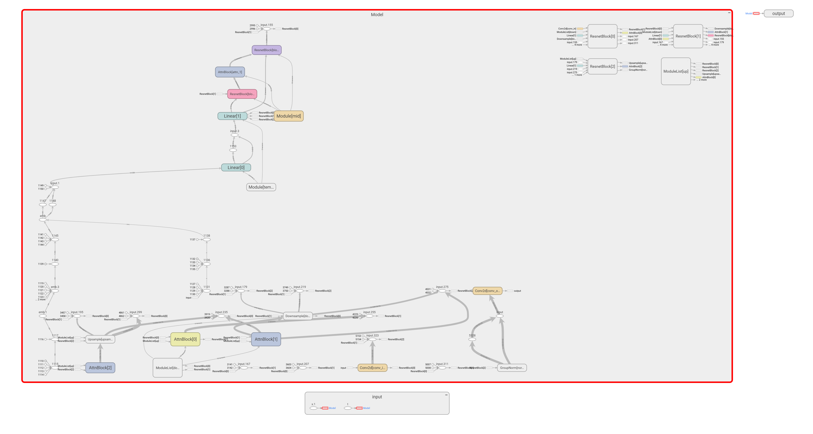

# Jittor-DDIM

**English| [简体中文](./README_CN.md)** 

   

## Project Overview

This project is a reimplementation of the complete training and sampling pipeline of the DDIM model using the Jittor framework. It is based on the [Denoising Diffusion Implicit Models (DDIM)](https://arxiv.org/abs/2010.02502) paper and the [original PyTorch project](https://github.com/ermongroup/ddim/tree/main). The goal of this project is to achieve the following:

- **Build the DDIM model structure from scratch using Jittor**, including key components such as UNet, ResNetBlock, Self-Attention, Timestep Embedding, etc.;
- **Align training and sampling results with the official PyTorch implementation** to verify model consistency;
- **Record and visualize the loss curves and training performance metrics** (e.g., GPU utilization, memory usage, time per step) for both frameworks;
- **Generate sampling animations (8x8 GIFs) from both frameworks** to compare image quality;
- **Provide open-source code, data preparation scripts, and logs**, all documented in this README.

This project is especially suitable for researchers and developers interested in understanding DDIM principles and evaluating Jittor's performance in image generation tasks.

## Project Structure & Alignment Notes (PyTorch vs Jittor)

The project strictly follows the original PyTorch implementation's directory structure and module division, ensuring one-to-one correspondence for easy comparison and migration. The table below compares the main directory structures of both versions with brief explanations:

| PyTorch Version (`DDIM-Pytorch/`)     | Jittor Version (`DDIM-jittor/`)       | Description |
|---------------------------------------|----------------------------------------|-------------|
| `main.py`                             | `main.py`                              | Main entry for training and sampling |
| `requirements.txt`                   | `requirements.txt`                    | Python dependency list |
| `stdout.txt`                         | `stdout.txt`                          | Redirected console output logs |
| `configs/`                           | `configs/`                            | Hyperparameter configs for datasets |
| `configs/cifar10.yml`               | `configs/cifar10.yml`                | CIFAR10 training config |
| `datasets/`                          | `datasets/`                           | Data loading modules |
| `datasets/celeba.py`                | `datasets/celeba.py`                 | CelebA dataset class |
| `datasets/utils.py`                 | `datasets/utils.py`                  | Utilities for data download, etc. |
| `functions/`                         | `functions/`                          | Loss functions, training utilities |
| `functions/losses.py`               | `functions/losses.py`                | Core DDIM loss logic |
| `functions/denoising.py`            | `functions/denoising.py`             | Sampling and denoising routines |
| `functions/ckpt_util.py`            | `functions/ckpt_util.py`             | Model checkpoint save/load |
| `functions/log.py`                  | `functions/log.py`                   | Training logger |
| `models/`                            | `models/`                             | Model architecture definitions |
| `models/diffusion.py`              | `models/diffusion.py`               | Main Diffusion network |
| `models/ema.py`                    | `models/ema.py`                     | Exponential moving average weights |
| `runners/`                           | `runners/`                            | Training process scheduler |
| `runners/diffusion.py`             | `runners/diffusion.py`              | Training and evaluation encapsulation |
| `tool/`                              | `tool/`                               | Visualization and post-processing tools |
| `tool/draw.py`                      | `tool/draw.py`                       | Plotting loss curves and results |
| `tool/convtpng.py`                  | `tool/convtpng.py`                   | Sampling image format converter |

> Note: The Jittor version is a full rewrite of the original PyTorch project.

## Environment Setup

Training and testing were conducted in the following software and hardware environment:

### System and Hardware

- OS: Ubuntu 22.04  
- Python: 3.10  
- GPU: NVIDIA RTX 4090 (24GB VRAM)  
- CUDA Driver: 11.8  
- CPU: Intel Xeon Gold 6430, 16 vCPUs  
- RAM: 120 GB  

> If your compute resources are limited, you can also run training on smaller datasets (e.g., CIFAR-10) with smaller batch sizes.

---

### Conda Virtual Environment

We recommend using Conda to manage your environment. Create one as follows:

```bash
conda create -n ddim-jittor python=3.10 -y
conda activate ddim-jittor
```

---

### Install Jittor

Install Jittor via pip:

```bash
pip install jittor -f https://cg.cs.tsinghua.edu.cn/jittor/assets/scripts/wheel.html
```

For details, see the [official Jittor installation guide](https://github.com/Jittor/jittor).

---

### Install Other Dependencies

Other dependencies are listed in `requirements.txt`. Install them using:

```bash
pip install -r requirements.txt
```

---

### Environment Verification

To verify if Jittor is correctly installed:
```python
import jittor as jt
jt.test()
```

You should see output indicating whether CUDA, cuDNN, and Jittor are functioning correctly.

---

```bash
python -c "import jittor as jt; jt.test()"
```

## Data Preparation

This project uses Jittor's built-in `CIFAR10` dataset class, which supports automatic downloading and loading.

### Automatic Data Download

On first run, Jittor will automatically download the dataset from the official source into the default directory (e.g., `~/.jittor/dataset/cifar/`). No manual handling is required. Use the following code to load the dataset:

```python
from jittor.dataset.cifar import CIFAR10

train_set = CIFAR10(train=True, download=True)
test_set = CIFAR10(train=False, download=True)
```

---

### Data Preprocessing Options

Data preprocessing is controlled via the configuration file (e.g., `configs/cifar10.yml`). The following options can be enabled or disabled depending on your experiment needs:

| Config Key               | Description |
|--------------------------|-------------|
| `logit_transform`        | Maps image pixel values from [0, 1] to (-∞, +∞) |
| `uniform_dequantization` | Adds uniform noise to original pixels for discrete → continuous conversion, alleviating gradient issues |
| `gaussian_dequantization`| Adds Gaussian noise instead of uniform, providing a more natural dequantization |
| `random_flip`            | Horizontally flips images to augment training diversity and improve generalization |
| `rescaled`               | Rescales image pixel values to [-1, 1] |

You can flexibly switch between training strategies by adjusting these options to evaluate their impact on model performance.

---

## Model Architecture

This model is implemented based on the architecture proposed in the DDIM paper. The overall network is constructed using a Wide ResNet U-Net structure. It is designed to model time steps, capture multi-scale spatial features, and fuse information using residual connections and attention mechanisms. The model input consists of noisy images xₜ at timestep t, and its goal is to predict the noise for progressive image restoration.

---

### Architecture Overview

The model structure is visualized using TensorBoard. The image below shows the main data flow and modules (click to enlarge):

<p align="center">
  
</p>

---

We first encode the discrete timestep `t` using a **Timestep Embedding** module. This module applies sinusoidal position encoding to produce a vector representation of `t`, followed by two linear layers for dimensional expansion. The resulting time vector is added (broadcasted) to feature maps in each ResNetBlock, enabling the model to be "aware" of the current diffusion step.

The **downsampling path** is specifically designed to extract deep semantic features. It consists of multiple residual blocks, and at certain resolutions, attention modules are added to enhance global modeling capability. Each downsampling layer reduces spatial dimensions by half and stores intermediate features for skip connections. Meanwhile, the channel width increases, allowing the model to capture more abstract information.

The **upsampling path** mirrors the downsampling path. At each stage, shallow features from earlier layers are concatenated with the current features, preserving fine-grained details. The upsampling operation combines nearest-neighbor interpolation with convolution to gradually restore the image resolution back to its original size.

The basic computation unit is the **ResnetBlock**, which contains normalization, activation, and convolution operations, plus a modulation term derived from the timestep embedding. It supports channel projection for flexible input/output dimensions and uses residual connections to stabilize training.

We also reproduce the **Self-Attention Block (AttnBlock)** from the original paper. This block enables the model to learn global spatial dependencies by flattening the feature map into sequences, computing Query-Key similarity, and applying the weighted attention over Values. Attention blocks are inserted between 16×16 resolution blocks, enhancing global coherence and structural fidelity.

---

All these modules together form the core DDIM model, fully defined in `models/diffusion.py`.

## Training Procedure

After environment setup, you can start training the model using:

```bash
python main.py --config {DATASET}.yml --exp {PROJECT_PATH} --doc {MODEL_NAME} --ni
```

Please replace the placeholders accordingly:

- `{DATASET}`: name of the dataset config file (e.g., `cifar10`, `celeba`);
- `{PROJECT_PATH}`: name of the experiment directory;
- `{MODEL_NAME}`: name of the log/documentation folder;

By default, CIFAR-10 is used. You may switch to CelebA, LSUN, or other datasets by selecting the appropriate `.yml` file in the `configs/` folder. Other training details such as architecture, optimizer, and batch size can be customized in the config file. For more parameters, refer to `main.py`.

---

### Logging

During training, each step logs the following:

- Current training step;
- Loss value for the current step;
- Time taken per step (in seconds);

Logs are saved under `.{exp}/logs/{doc}/`, making it easy to visualize and compare results later.

---

### Sample Log Output (Excerpt)

```
INFO - diffusion.py - 2025-07-04 00:04:10,778 - [Epoch 0] Step: 1, Loss: 0.768200, Step Time: 0.033s  
INFO - diffusion.py - 2025-07-04 00:04:11,062 - [Epoch 0] Step: 2, Loss: 0.584475, Step Time: 0.237s  
INFO - diffusion.py - 2025-07-04 00:04:11,235 - [Epoch 0] Step: 3, Loss: 0.456178, Step Time: 0.125s  
...
```

---

## Testing and Sampling

After training, or when using a pre-trained model, you can perform image sampling and FID evaluation using the commands below.

---

### Sampling with Pretrained Weights

```bash
python main.py --config {DATASET}.yml --exp {PROJECT_PATH} --use_pretrained --sample --fid --timesteps {STEPS} --eta {ETA} --ni
```

Replace parameters as appropriate:

- `{DATASET}`: config file name (e.g., `cifar10`, `celeba`);
- `{PROJECT_PATH}`: experiment folder name;
- `{STEPS}`: number of sampling steps;
- `{ETA}`: control parameter in DDIM sampling;
- `--fid`: enables FID evaluation during sampling;
- `--use_pretrained`: loads pretrained model weights for sampling.

---

### Notes on Loading Pretrained Weights in Jittor

Downloaded pretrained models are in `.ckpt` format, which Jittor does **not** support directly.

You must follow these steps:

1. Convert the `.ckpt` file into `.pkl` format;
2. Modify **line 246** of `./runners/diffusion.py` to specify the `.pkl` weight path;
3. Modify **line 269** to update `total_sample_num`.  
   It **must be ≥ batch_size × n_batches** (as defined in the config),  
   otherwise fewer images will be generated than expected.

---

### Sampling from a Self-Trained Model

To sample from a model you trained yourself, use the following command:

```bash
python main.py --config {DATASET}.yml --exp {PROJECT_PATH} --sample --fid --timesteps {STEPS} --eta {ETA} --ni
```

Make sure to:

- Modify **line 190** in `./runners/diffusion.py` to point to your trained model’s weights;
- Ensure the number of generated images ≥ `batch_size × n_batches`.

---

### Generate 8×8 GIF Animation (Sampling Visualization)

To visualize the sampling process, run:

```bash
python main.py --config {DATASET}.yml --exp {PROJECT_PATH} --sample --gif --image_folder {IMAGES_PATH} --timesteps {STEPS} --eta {ETA} --ni
```

- The output GIF will contain 1000 frames, with a playback time of about 200 seconds — this may take time to render;
- The final GIF will be saved under `{PROJECT_PATH}/images_sample/{IMAGES_PATH}/`.

---

### Evaluating Generated Images (FID Score)

After sampling, run the following to evaluate FID:

```bash
python main.py --config {DATASET}.yml --exp {PROJECT_PATH} --test
```

Before running, make sure to update these paths:

- **Line 471** in `./runners/diffusion.py`: path to generated images;
- **Line 472**: path to the real dataset (for comparison during FID computation).

---

### FID Tool Compatibility Note

This project uses `clean-fid` for computing FID scores. However, please note:

> **`clean-fid` is designed for PyTorch environments**.  
> It relies on PyTorch to load the InceptionV3 model and cannot be used in a pure Jittor setup.

Therefore, in Jittor, you'll need to **manually implement and load** InceptionV3 weights to support evaluation.  
This remains an area for improvement. Currently, this project generates samples using Jittor, but evaluates FID using PyTorch tools externally.

---

## Model Alignment and Performance Comparison

To verify the validity and efficiency of this Jittor implementation, we conducted alignment experiments with the original PyTorch version and visualized the training logs using TensorBoard.

- Dataset: CIFAR-10  
- Batch Size: 128  
- Training Epochs: 2000  
- Total Training Steps: ~7,000,000  
- Number of Threads: 8  
- Total Training Time: ~23 hours  

---

### Loss Curve Comparison

<div align="center">
  
  <p><i>PyTorch training loss curve</i></p>

  
  <p><i>Jittor training loss curve</i></p>
</div>

From the figures above, both loss curves show nearly identical trends. The loss decreases by 95%–98% and converges around 0.03, indicating that the Jittor implementation achieves almost identical training accuracy to the PyTorch version.

---

### Per-Step Training Time Analysis

<div align="center">
  
  <p><i>PyTorch training time per step</i></p>
  
  
  <p><i>Jittor training time per step</i></p>
</div>

PyTorch shows consistently stable performance with ~0.16s per step.  
Jittor is generally faster at ~0.12s per step, but experiences occasional spikes to 0.6–0.7s, raising the overall average.

**This behavior might be due to internal memory scheduling or delayed kernel compilation in Jittor. It may also be caused by suboptimal script design not fully compatible with Jittor’s execution model — further analysis is needed.**

---

### GPU Memory Usage Comparison

<div align="center">
  
  <p><i>PyTorch GPU memory usage</i></p>

  
  <p><i>Jittor GPU memory usage</i></p>
</div>

In terms of GPU memory, PyTorch remains stable at ~10,000 MiB, while Jittor consistently uses ~15,000 MiB.

**This may indicate that Jittor retains more intermediate computation graphs or uses a more aggressive caching mechanism, possibly aiming for faster speed at the cost of higher memory — though in practice, the speed gain is debatable.**

---

### GPU Utilization Comparison

<div align="center">
  
  <p><i>PyTorch GPU utilization</i></p>

  
  <p><i>Jittor GPU utilization</i></p>
</div>

PyTorch maintains a stable GPU utilization rate of 98%–100% throughout training.  
In contrast, Jittor shows much more fluctuation, averaging around 70%–80%.

**During training with Jittor, I observed CPU usage around 20%–30%, suggesting possible CPU-GPU synchronization overhead. GPT mentioned that some submodules might not fully run on GPU — though I’m not entirely convinced and suspect the issue may lie elsewhere.**

---

### Summary of Comparison

| Metric              | PyTorch           | Jittor                        |
|---------------------|-------------------|-------------------------------|
| Loss Alignment      | Consistent        | Consistent                    |
| Step Time           | Stable at 0.16s   | Faster but unstable (0.12–0.7s) |
| GPU Memory Usage    | ~10GB             | ~15GB                         |
| GPU Utilization     | Stable 98%+       | Unstable, average ~80%        |

---

## Sample Generation and FID Score Comparison

To systematically evaluate generation quality and sampling performance under both frameworks, we conducted sampling experiments using the final trained models on CIFAR-10.

- Each configuration generates **5,000 images**;
- The reference set is the **CIFAR-10 train + test sets (total 60,000 images)**;
- FID is computed using the [`clean-fid`](https://github.com/GaParmar/clean-fid) tool  
  (⚠ Only works in PyTorch; Jittor’s InceptionV3 implementation is still incomplete);
- For better stability, it's recommended to generate ≥10,000 images if resources allow.

---

### Sampling Settings and Evaluation Summary

> Each configuration sampled 5,000 CIFAR-10 images. We recorded the average sampling time and FID score.

| Steps | η   | PyTorch: Avg Time (s/img) | PyTorch FID | Jittor: Avg Time (s/img) | Jittor FID |
|-------|-----|----------------------------|-------------|----------------------------|------------|
| 50    | 0.0 | 0.0269                     | 14.223      | 0.0220                     | 12.588     |
| 50    | 0.5 | 0.0262                     | 15.432      | 0.0220                     | 13.897     |
| 50    | 1.0 | 0.0252                     | 23.886      | 0.0221                     | 20.928     |
| 100   | 0.0 | 0.0448                     | 12.466      | 0.0384                     | 10.963     |
| 100   | 0.5 | 0.0448                     | 13.643      | 0.0403                     | 11.735     |
| 100   | 1.0 | 0.0461                     | 19.254      | 0.0383                     | 16.693     |
| 500   | 0.0 | 0.2023                     | 10.587      | 0.2012                     | **9.570**  |
| 500   | 0.5 | 0.2021                     | 10.816      | 0.2086                     | **9.769**  |
| 500   | 1.0 | 0.2028                     | 12.781      | 0.2021                     | 11.165     |
| 1000  | 0.0 | 0.3883                     | 10.411      | 0.4110                     | **9.521**  |
| 1000  | 0.5 | 0.3977                     | 10.160      | 0.4061                     | **9.589**  |
| 1000  | 1.0 | 0.3989                     | 11.454      | 0.4118                     | 10.236     |

---

### Analysis and Summary

- **Sampling Speed**: Jittor is consistently faster than PyTorch across all step settings (e.g., 0.022s vs. 0.026s at step=50);
- **FID Scores**: At step ≥ 500, Jittor shows a slight edge in generation quality, achieving a **best FID of 9.521** (η=0, step=1000);
- **Fewer steps lead to worse FID**, and a high η (e.g., η=1.0) yields less stable results in low-step settings;
- **Lower η values** (e.g., η=0.0) generally produce better results and are preferred for accuracy-first sampling.

**Overall, Jittor demonstrates slight advantages in sampling speed and FID under matched accuracy conditions.**

---

### 8×8 GIF Sample Comparison (Sampling Visualization)

I generated **two GIFs from each framework** (8×8 layout) to visualize the sampling trajectory. (Each ~5s playback, please wait to load.)

#### PyTorch Sampling

<div align="center">
  
  
</div>

<p align="center"><i>Sampling GIFs from PyTorch-trained models</i></p>

---

#### Jittor Sampling

<div align="center">
  
  
</div>

<p align="center"><i>Sampling GIFs from Jittor-trained models</i></p>

---

## Pitfalls and Notes from Migration

During the migration of the DDIM model from PyTorch to Jittor, I encountered a number of unexpected issues. Here are some real-world problems I faced, along with thoughts and lessons that may help others:

1. **Compiler (g++) version**:  
   The first major blocker was the compiler. Since Jittor uses just-in-time compilation on first run, outdated `g++` versions cause immediate crashes. On Ubuntu, I originally had `g++ 7`, which failed. Upgrading to `g++ 9.4` and setting it as the system default finally resolved it.  Jittor is sensitive to system dependencies — get your toolchain right from the beginning.

2. **Device management differs from PyTorch**:  
   In PyTorch, we manually move tensors using `.to(device)` or `.cuda()`. In contrast, Jittor handles device placement automatically, which simplifies code but also reduces control. I initially attempted to control memory by manually switching devices — but it had no effect. Jittor lacks `.cuda()` entirely, and requires using `jt.flags.use_cuda` or environment variables for GPU behavior control.

3. **FID evaluation limitations**:  
   PyTorch has great tools like `clean-fid` for evaluation. In contrast, Jittor lacks a native FID pipeline. So for now, I had to generate samples in Jittor but evaluate them externally using PyTorch tools.

4. **Visualization tools**:  
   I wanted a TensorBoard-like tool for visualizing training. Jittor does offer **JittorVis**, but it's underdeveloped, with poor documentation and limited community usage. I looked into its source code to embed it into my pipeline but haven't fully succeeded — future exploration planned.

5. **Framework philosophy mismatch**:  
   PyTorch uses `nn.Module` + `forward()`, while Jittor uses `jt.Module` + `execute()`. That meant rewriting all modules by hand. Tensor broadcasting and shape handling also differ subtly. Some functions look similar in name but behave differently or expect different argument formats — leading to runtime errors if not careful.

---

Despite these technical challenges, the migration succeeded:  Model architecture, convergence curves, sampling results, and performance are now fully aligned.  Jittor does offer some efficiency benefits over PyTorch, but the ecosystem still lags behind.  I hope this documentation helps others attempting cross-framework implementations.

---
